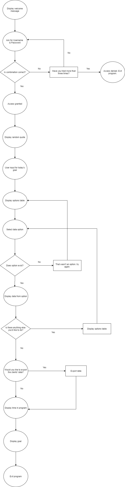

**Software Development Plan**

**Statement of Purpose and Scope**
The application described in this plan has been designed to work as a Customer Relationship Management system which keeps track of customers’ status in a given business. 
It allows the user to log in to access the application, receive daily motivation from inspirational quotes, keep track of their daily goals and perform specific functions such as viewing all clients, adding new clients and updating the status of each client. The program also allows the user to export the client data in csv format and logs time of log in and minutes spent in the program.
This application will allow users to successfully manage customers in their business by keeping track of their status (onboarded or offboarded), payment status and initial quote with the option to update all these details. 
The target audience is any business owners who would like to keep track of their customers in an easy to use and flexible application.

**List of Features**
Feature 1: Login with username and password
This feature allows multiple users to login to the application through username and password combinations stored in the username.py file as a dictionary data type. The program prompts for the correct username and password combination in a while loop which checks the username.py file and gives access to the application with the correct combination. An incorrect combination will loop three times before exiting the loop and the program completely which mimics being locked out of the program.

Feature 2: Viewing and accessing client data
The program allows users to access client data in multiple ways such as viewing all client data, client names and the total money owed by clients who haven’t paid. After the user selects one option and displays the data, the program loops until a condition is met to exit the loop i.e. the user selects “N” to the question “Would you like to do anything else?” The program reads the client information from the data file using JSON format as the data is stored as the dictionary data type. An example of the information in the data file is shown below where the Key of the dictionary is the client’s name, and the value of the dictionary is a list with the client status, payment status and initial quote:
{"Spiro": ["onboarded", "paid", 100]}

Feature 3: Manipulating and adding new client data 
The program also allows the user to manipulate the data in the data file and write to it in JSON format either by adding a new client altogether or updating the values in the dictionary by accessing indexes in the list as shown above. All of these steps are handled by loops and error handling which checks the input from the user to make sure that the input is valid for e.g. if the initial quote is an integer otherwise an error message will be returned and prompt the user to input the correct value. The while loop continues until the user inputs “N” in the program at the prompt.  

Feature 4: Storing log in times, daily goals and displaying random inspirational quotes
The application stores the login times using the pytz module for writing the time based on Sydney time in the time_log file. It also prompts the user to write a daily goal which is stored in a separate file based on date (goal_log) and displays a random quote using the random module from the quotes.py file.

Feature 5: Exporting all client data to CSV
At the end of the application, the program prompts the user if they would like to export the client data in CSV format. If the user selects “Y”, the program reads the data file and writes it to the all_clients.csv file. If the user selects “N”, the program exists by displaying the goal submitted at the beginning of the program and a farewell message.

**User interaction and experience**

The user will interact through a series of prompts in the terminal. The prompts will assist the user to select the correct option and will display an error message if the user types the incorrect input.
The program begins with a welcome message and sleeps for 2 seconds.
The program then prompts for the correct username and password combination at the beginning of the program and gives access to the application with the correct combination. If the user inputs 3 incorrect combinations in a row the program will exit.
The program displays the current time of log in and stores this data in the time_log file.
The program displays a random inspirational quote.
The program prompts the user to enter a goal for the day which will be displayed before the user exits the program and logged in the goal_log file.
The program then asks if the user would like to do anything else in a loop which is broken by selecting “N”. If the user selects “Y” a table is displayed with various options.
Once an option is chosen there are various prompts either for more user input or if there is only a display of information the previous loop starts again. 
If the user needs to input information then loops and try and except blocks are used to handle any incorrect information inputted by the user.
If the user selects an option not in the table the user will be prompted again to select a listed option.
Once the user selects “N” in the above loop, they are asked if they would like to export the client data to CSV. Selecting “Y” or “N” will continue the program.
The program will display the overall time that the user was logged in in minutes.
The program will display the user’s goal for the day and then show a farewell message before exiting the program.

**Control Flow Diagram**

**Implementation Plan**
See spreadsheet. 

**Developer Operations**
See screenshots for tracking development.

